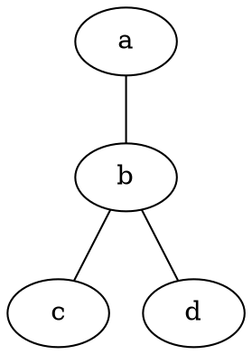
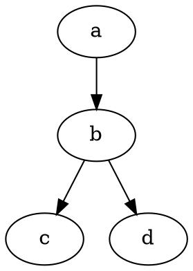

# Dot 

A graph described in **DOT** is usually a text file with a .gv or .dot extension in a format readable by humans and the processing program.

Graphs described in the DOT language are represented graphically using special programs, such as **Graphviz**.

## Example of an undirected graph in the DOT language

An undirected graph in DOT is described by a list of vertices and edges represented by the name of vertices, and a double dash (--) between connected vertices.

Or equivalently, by leaving out excessive descriptions:

## Example of a directed graph in the DOT language

A directed graph in DOT is described by a list of vertices and edges, represented by the names of vertices, and a dash with triangular bracket - arrow (->), between the connected vertices:

Or with excessive descriptions:

