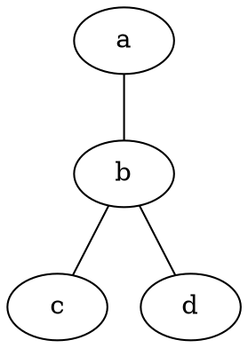
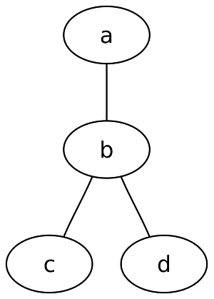
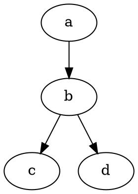
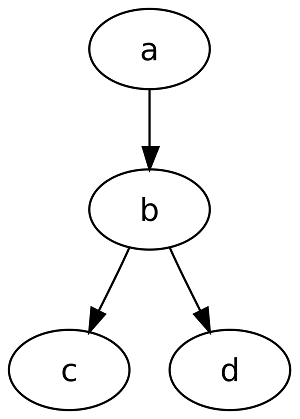

# Dot 

Граф, описанный на языке **DOT**, обычно представляет собой текстовый файл с расширением .gv или .dot в понятном для человека и обрабатывающей программы формате.

В графическом виде графы, описанные на языке DOT, представляются с помощью специальных программ, например **Graphviz**.

## Пример неориентированного графа, заданного на языке DOT

Неориентированный граф в языке DOT описывается списком вершин и рёбер, представленных названием вершин и двойным тире (--) между связанными вершинами.

Или эквивалентным образом, опустив избыточные описания:

## Пример ориентированного графа, заданного на языке DOT

Ориентированный граф в языке DOT описывается списком вершин и рёбер, представленных названием вершин и стилизованной тире и треугольной скобкой — стрелочкой (->), между связанными вершинами:

Либо с избыточным описанием:

